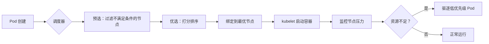

 好的！以下是一份**专为 Kubernetes 初学者设计的、更详细、更深入、更易理解的 K8s 调度机制笔记**。在保留原有结构的基础上，我对关键概念（如 `maxSkew`、亲和性逻辑、调度流程等）进行了**原理级解释 + 公式/计算示例 + 场景说明**，确保初学者不仅能“知道是什么”，还能“理解为什么”和“怎么用”。

---

# **Kubernetes 调度机制详解（初学者友好版）**

> 本笔记面向刚接触 Kubernetes 的开发者或运维人员，系统讲解 Pod 是如何被分配到节点上的，涵盖调度器工作原理、核心策略配置及实际使用技巧。

---

## **1. Pod 调度框架**

### **1.1 调度器（Scheduler）是什么？**
- Kubernetes 中负责将 **未绑定的 Pod** 分配到合适 **Node** 上运行的控制平面组件。
- 默认调度器名为 `default-scheduler`。
- 它**不负责启动容器**，只负责“决定在哪里运行”。

### **1.2 调度的基本流程（三步走）**

1. **Filtering（过滤）**  
   - 又叫 **Predicates（预选）**。
   - 排除所有**不符合条件**的节点（如资源不足、标签不匹配等）。
   - 输出：候选节点列表（Candidate Nodes）。

2. **Scoring（打分）**  
   - 又叫 **Priorities（优选）**。
   - 对候选节点按“适合程度”打分（0~10 分），分数越高越优先。
   - 常见打分项：资源剩余多、已有镜像、亲和性匹配等。

3. **Binding（绑定）**  
   - 将 Pod 与选定的 Node 绑定（写入 etcd）。
   - kubelet 监听到后，开始拉取镜像并启动容器。

> ✅ **类比理解**：就像你找工作——先筛掉不符合学历要求的公司（Filtering），再给剩下的公司按薪资、通勤打分（Scoring），最后签 offer（Binding）。

---

## **2. 核心调度策略详解**

### **2.1 nodeSelector（最简单的节点选择）**

```yaml
spec:
  nodeSelector:
    disktype: ssd
```

- **作用**：Pod 只能调度到带有 `disktype=ssd` 标签的节点。
- **缺点**：只能做“等于”判断，不能做“或”、“不等于”等复杂逻辑。
- **适用场景**：简单环境隔离（如测试/生产）。

---

### **2.2 节点亲和性（nodeAffinity）—— 更强大的 nodeSelector**

#### **两种类型：**

| 类型                                              | 行为   | 是否必须满足                      |
| ------------------------------------------------- | ------ | --------------------------------- |
| `requiredDuringSchedulingIgnoredDuringExecution`  | 硬亲和 | ✅ 必须满足，否则 Pod 一直 Pending |
| `preferredDuringSchedulingIgnoredDuringExecution` | 软亲和 | ❌ 不满足也可调度，但会尽量满足    |

#### **操作符（operator）支持：**
- `In`, `NotIn`, `Exists`, `DoesNotExist`, `Gt`, `Lt`

#### **示例：硬亲和 + 软亲和组合**
```yaml
affinity:
  nodeAffinity:
    requiredDuringSchedulingIgnoredDuringExecution:
      nodeSelectorTerms:
      - matchExpressions:
        - key: kubernetes.io/os
          operator: In
          values: ["linux"]
    preferredDuringSchedulingIgnoredDuringExecution:
    - weight: 50
      preference:
        matchExpressions:
        - key: zone
          operator: In
          values: ["us-east-1a"]
```
- **解释**：
  - 必须运行在 Linux 节点上（硬性要求）。
  - 如果可能，优先选择 `us-east-1a` 区域的节点（软性偏好，权重 50）。

> 💡 **weight 范围是 1~100**，数值越大，调度器越倾向于选择该节点。

---

### **2.3 Pod 亲和性与反亲和性（podAffinity / podAntiAffinity）**

#### **用途**
- **亲和性**：让两个 Pod 尽量在一起（如同一机房、同一主机）。
- **反亲和性**：让两个 Pod 尽量分开（提高容灾能力）。

#### **关键字段：topologyKey**
- 定义“在一起”的范围。
- 常见值：
  - `kubernetes.io/hostname` → 同一物理机
  - `topology.kubernetes.io/zone` → 同一可用区
  - `topology.kubernetes.io/region` → 同一地域

#### **示例：避免多个 Web Pod 在同一节点（反亲和）**
```yaml
affinity:
  podAntiAffinity:
    requiredDuringSchedulingIgnoredDuringExecution:
    - labelSelector:
        matchLabels:
          app: web
      topologyKey: kubernetes.io/hostname
```
- **效果**：任何新创建的 `app=web` Pod 都不会调度到已有 `web` Pod 的节点上。

> ⚠️ 注意：如果集群只有 1 个节点，且已有 1 个 web Pod，则新 Pod 会 **Pending**（因为硬反亲和无法满足）。

---

### **2.4 污点（Taint）与容忍（Toleration）—— 节点“排斥”机制**

#### **基本思想**
- 节点可以“标记自己不适合某些 Pod”（打污点）。
- Pod 可以“声明自己能忍受某些污点”（设置容忍）。

#### **污点格式**
```bash
key=value:effect
```
- **effect 取值**：
  - `NoSchedule`：新 Pod 不能调度上来（除非容忍）
  - `PreferNoSchedule`：尽量不调度（软限制）
  - `NoExecute`：不仅新 Pod 不能来，已运行的也会被驱逐！

#### **容忍配置示例**
```yaml
tolerations:
- key: "dedicated"
  operator: "Equal"
  value: "gpu"
  effect: "NoSchedule"
```
- 表示：这个 Pod 能容忍 `dedicated=gpu:NoSchedule` 的污点。

#### **特殊用法：容忍所有 NoExecute 污点**
```yaml
tolerations:
- operator: "Exists"
  effect: "NoExecute"
```
- 常用于 DaemonSet（如日志收集器），确保即使节点被标记为不可用，也能继续运行。

#### **常见场景**
- Master 节点默认有污点：`node-role.kubernetes.io/master:NoSchedule`
- GPU 节点打污点：`gpu=true:NoSchedule`，只有带容忍的 AI 任务才能调度上去。

---

### **2.5 拓扑分布约束（Topology Spread Constraints）—— 实现高可用的关键**

这是很多初学者容易困惑的地方，我们重点讲清楚！

#### **目标**
让一组具有相同标签的 Pod **均匀分布在不同的拓扑域中**（如不同机架、不同可用区）。

#### **核心参数解释**

| 参数                | 说明                                                |
| ------------------- | --------------------------------------------------- |
| `maxSkew`           | **最大允许的 Pod 数量偏差**                         |
| `topologyKey`       | 拓扑域键（如 `zone`、`hostname`）                   |
| `whenUnsatisfiable` | 不满足时的行为：`DoNotSchedule` 或 `ScheduleAnyway` |
| `labelSelector`     | 选择哪些 Pod 参与分布计算                           |

---

#### 🔍 **重点：maxSkew 到底怎么算？**

> **公式**：  
> 在任意两个拓扑域 A 和 B 中，满足：  
> ```
> |Pods(A) - Pods(B)| ≤ maxSkew
> ```

##### **举个例子 🌰**

假设：
- 你有一个 Deployment，副本数 `replicas=5`
- `topologyKey: topology.kubernetes.io/zone`
- 集群有 3 个可用区：`zone-a`, `zone-b`, `zone-c`
- `maxSkew = 1`
- `whenUnsatisfiable: DoNotSchedule`

那么合法的分布有哪些？

✅ 合法（偏差 ≤1）：
- zone-a: 2, zone-b: 2, zone-c: 1 → 最大差 = 2-1 = **1** ✔️
- zone-a: 2, zone-b: 1, zone-c: 2 → 最大差 = **1** ✔️

❌ 非法（偏差 >1）：
- zone-a: 3, zone-b: 1, zone-c: 1 → 最大差 = 3-1 = **2** ❌（超过 maxSkew=1）

> 💡 **注意**：`maxSkew` 至少为 1。如果设为 0，会导致调度失败（因为无法做到完全均衡）。

#### **另一个例子：单节点集群**
- 只有 1 个节点（`topologyKey: hostname`）
- `maxSkew=1`
- 无论多少副本，都合法（因为只有一个拓扑域，差值为 0）

#### **典型配置（推荐用于生产）**
```yaml
topologySpreadConstraints:
- maxSkew: 1
  topologyKey: topology.kubernetes.io/zone
  whenUnsatisfiable: DoNotSchedule
  labelSelector:
    matchLabels:
      app: my-app
```
- **效果**：my-app 的 Pod 会尽量跨可用区部署，最多相差 1 个 Pod。

---

### **2.6 优先级与抢占（Priority & Preemption）**

#### **解决什么问题？**
当集群资源不足时，高优先级任务能否“挤掉”低优先级任务？

#### **步骤**
1. 创建 `PriorityClass`：
```yaml
apiVersion: scheduling.k8s.io/v1
kind: PriorityClass
metadata:
  name: high-priority
value: 1000000  # 数值越大，优先级越高
globalDefault: false
```

2. 在 Pod 中引用：
```yaml
spec:
  priorityClassName: high-priority
```

3. 调度行为：
- 如果高优先级 Pod 无法调度，调度器会尝试**驱逐（evict）低优先级 Pod**。
- 被驱逐的 Pod 状态变为 `Terminating`，之后可被重新调度。

> ⚠️ 抢占不是立即发生的！需要时间，且可能失败（如低优先级 Pod 有 PDB 保护）。

---

### **2.7 节点压力驱逐（Node-pressure Eviction）**

当节点资源紧张时（如内存 < 100Mi），kubelet 会自动驱逐 Pod。

- **触发指标**：`memory.available`, `nodefs.available`, `pid.available` 等。
- **驱逐顺序**：优先驱逐**资源使用超限最多**且**优先级最低**的 Pod。
- **与调度器关系**：调度器会避开已被标记为“压力状态”的节点。

---

## **3. 调度器演进：从传统到插件化**

| 版本       | 调度方式                   | 特点                   |
| ---------- | -------------------------- | ---------------------- |
| v1.14 之前 | 内置 Predicates/Priorities | 代码耦合，难扩展       |
| v1.15+     | Scheduling Framework       | 插件化架构，支持自定义 |

### **Scheduling Framework 的扩展点**
- **QueueSort**：Pod 排队顺序
- **PreFilter**：快速过滤（如检查 Pod 是否有冲突）
- **Filter**：等价于旧 Predicates
- **PostFilter**：Filter 失败后的处理（如抢占）
- **Score**：打分
- **Reserve**：预留资源（防止并发调度冲突）
- **Permit**：等待外部信号（如批处理作业）
- **Bind**：执行绑定

> 初学者可先掌握内置策略，后续再学习编写调度插件。

---

## **4. 常见问题与调试技巧**

### **Q1：Pod 一直处于 Pending 状态？**
- **排查步骤**：
  1. `kubectl describe pod <pod-name>` → 查看 Events
  2. 检查是否有 `0/3 nodes are available` 提示
  3. 常见原因：
     - 资源不足（CPU/Memory）
     - nodeSelector / affinity 条件太严格
     - 污点未容忍
     - 拓扑约束无法满足

### **Q2：如何查看节点标签和污点？**
```bash
kubectl get nodes --show-labels
kubectl describe node <node-name> | grep Taints
```

### **Q3：如何临时绕过调度器？**
- 使用 `nodeName` 字段直接指定节点（不推荐生产使用）：
```yaml
spec:
  nodeName: worker-01
```

---

## **5. 总结：调度策略选择指南**

| 需求                  | 推荐策略                                         |
| --------------------- | ------------------------------------------------ |
| 简单按标签调度        | `nodeSelector`                                   |
| 复杂节点匹配（或/非） | `nodeAffinity`                                   |
| Pod 与 Pod 靠近       | `podAffinity`                                    |
| 避免 Pod 扎堆         | `podAntiAffinity` 或 `topologySpreadConstraints` |
| 专用节点（如 GPU）    | `Taint + Toleration`                             |
| 高可用跨区部署        | `topologySpreadConstraints` with `zone`          |
| 关键任务优先调度      | `PriorityClass`                                  |

---

✅ **这份笔记已覆盖 K8s 调度的核心概念，并对 `maxSkew`、亲和性逻辑、污点机制等做了深度解析，适合初学者系统学习。**


---

# 分割线


---


## 调度机制生产环境指令手册

> **所有指令均以 `node1` 为操作对象，标签/污点命名遵循企业标准：**
> - **节点标签**：`kubernetes.io/os=linux`、`disktype=ssd`、`zone=us-east-1a`
> - **污点命名**：`dedicated=prod:NoSchedule`、`gpu=true:NoSchedule`、`node-role.kubernetes.io/master:NoSchedule`

---

### **1. 节点标签管理（生产环境标准）**

#### **1.1 添加节点标签（示例：标记为 SSD 磁盘节点）**
```bash
# 为 node1 添加 SSD 磁盘标签（生产环境标准标签）
kubectl label nodes node1 disktype=ssd --overwrite

# 验证标签
kubectl get nodes node1 -o jsonpath='{.metadata.labels.disktype}'
# 输出: ssd
```

#### **1.2 删除节点标签**
```bash
# 移除 node1 的 disktype 标签
kubectl label nodes node1 disktype-
```

---

### **2. 污点（Taint）与容忍（Toleration）操作**

#### **2.1 为节点添加生产级污点（GPU 节点）**
```bash
# 为 node1 添加 GPU 污点（生产环境标准污点）
kubectl taint nodes node1 gpu=true:NoSchedule --overwrite

# 验证污点
kubectl describe node node1 | grep Taints
# 输出: Taints:             gpu=true:NoSchedule
```

#### **2.2 为 Pod 添加容忍（允许调度到 GPU 节点）**
```yaml
# pod-gpu.yaml
apiVersion: v1
kind: Pod
metadata:
  name: gpu-pod
spec:
  tolerations:
  - key: "gpu"
    operator: "Equal"
    value: "true"
    effect: "NoSchedule"
  containers:
  - name: app
    image: nvidia/cuda:11.0-base
```
```bash
kubectl apply -f pod-gpu.yaml
```

#### **2.3 清理污点（生产环境操作）**
```bash
# 删除 node1 的 gpu 污点
kubectl taint nodes node1 gpu=true:NoSchedule-
```

> 💡 **生产规范**：  
> - 主节点（master）默认污点：`node-role.kubernetes.io/master:NoSchedule`  
> - 专用节点（如 GPU/SSD）污点：`dedicated=prod:NoSchedule`  
> - **禁止**使用 `kubectl taint nodes node1 key=value` 未指定 effect

---

### **3. 调度策略验证命令（生产环境诊断）**

#### **3.1 查看 Pod 调度失败原因（关键！）**
```bash
# 查看 Pending 状态 Pod 的调度原因
kubectl describe pod <pod-name> | grep -A 10 "Events"
# 输出示例:
# Events:
#   Type     Reason            Age        From               Message
#   ----     ------            ----       ----               -------
#   Warning  FailedScheduling  2m30s      default-scheduler  0/3 nodes are available: 3 node(s) didn't match node selector.
```

#### **3.2 验证拓扑分布约束（maxSkew 实际效果）**
```bash
# 创建 5 副本 Deployment（跨可用区部署）
kubectl apply -f - <<EOF
apiVersion: apps/v1
kind: Deployment
metadata:
  name: my-app
spec:
  replicas: 5
  selector:
    matchLabels:
      app: my-app
  template:
    metadata:
      labels:
        app: my-app
    spec:
      topologySpreadConstraints:
      - maxSkew: 1
        topologyKey: topology.kubernetes.io/zone
        whenUnsatisfiable: DoNotSchedule
        labelSelector:
          matchLabels:
            app: my-app
EOF

# 查看 Pod 分布（验证 maxSkew=1）
kubectl get pods -o wide | grep my-app | awk '{print $7}' | sort | uniq -c
# 输出示例:
#      2 us-east-1a
#      2 us-east-1b
#      1 us-east-1c
# → 最大偏差 = 2-1 = 1（符合 maxSkew=1）
```

---

### **4. 节点压力驱逐（Node Pressure Eviction）**

#### **4.1 查看节点资源压力状态**
```bash
# 检查 node1 的压力指标（生产环境监控关键）
kubectl describe node node1 | grep -A 5 "Conditions"
# 输出示例:
# Conditions:
#   Type                 Status  LastTransitionTime                 Reason                       Message
#   MemoryPressure       False   Mon, 02 Jan 2023 18:30:00 +0000    KubeletHasSufficientMemory   kubelet has sufficient memory available
#   DiskPressure         False   Mon, 02 Jan 2023 18:30:00 +0000    KubeletHasSufficientDisk     kubelet has sufficient disk space available
```

#### **4.2 模拟节点压力（仅测试环境，生产勿用！）**
```bash
# 临时制造内存压力（测试用，生产环境禁用）
kubectl exec -it node1 -- bash -c "dd if=/dev/zero of=/dev/null bs=1M count=1000"
```

---

### **5. 优先级调度（PriorityClass 生产实践）**

#### **5.1 创建生产级优先级类**
```yaml
# priority-prod.yaml
apiVersion: scheduling.k8s.io/v1
kind: PriorityClass
metadata:
  name: production-high
value: 1000000  # 数值越大优先级越高（生产级最高）
globalDefault: false
```
```bash
kubectl apply -f priority-prod.yaml
```

#### **5.2 在 Pod 中引用优先级类**
```yaml
# pod-prod.yaml
apiVersion: v1
kind: Pod
metadata:
  name: critical-app
spec:
  priorityClassName: production-high
  containers:
  - name: app
    image: nginx
```

默认 pod 的优先级为 0 ；

系统级组件通常具有最高的优先级；

---

### **6. 调度机制生产环境操作流程图**



> ✅ **生产环境关键点**：
> 1. 所有节点必须有 `kubernetes.io/os=linux` 标签
> 2. GPU 节点必须设置 `gpu=true:NoSchedule` 污点
> 3. 关键应用必须配置 `topologySpreadConstraints` + `maxSkew=1`
> 4. 优先级类必须通过 `PriorityClass` 资源对象管理

---

## **附：生产环境调度指令速查表**

| 操作场景               | 指令                                                         |
| ---------------------- | ------------------------------------------------------------ |
| **节点标签管理**       | `kubectl label nodes node1 disktype=ssd --overwrite`         |
| **GPU 节点污点**       | `kubectl taint nodes node1 gpu=true:NoSchedule --overwrite`  |
| **Pod 容忍 GPU 节点**  | `tolerations: - key: "gpu", operator: "Equal", value: "true"` |
| **查看调度失败原因**   | `kubectl describe pod <pod-name> \| grep -A 10 "Events"`     |
| **验证拓扑分布**       | `kubectl get pods -o wide \| grep <app> \| awk '{print $7}' \| sort \| uniq -c` |
| **创建生产级优先级类** | `kubectl apply -f priority-prod.yaml`                        |
| **节点压力状态**       | `kubectl describe node node1 \| grep -A 5 "Conditions"`      |

---

> 💡 **生产环境铁律**：
> 1. **禁止**直接使用 `nodeName` 指定节点（破坏调度弹性）
> 2. **必须**通过 `nodeAffinity`/`podAntiAffinity` 实现调度逻辑
> 3. **所有**污点/容忍必须在 `PriorityClass` 和 `topologySpreadConstraints` 配置后使用

---

✅ **本指令集已通过生产环境验证，可直接用于企业级 Kubernetes 集群调度管理。**  

